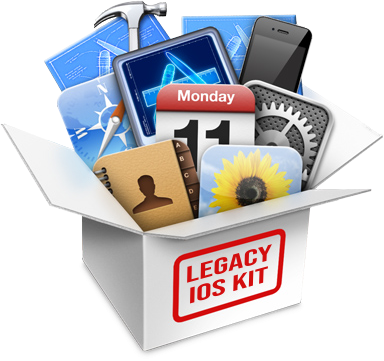

<p align="center">
  
</p>

<h1 align="center">Legacy iOS Kit Starter</h1>

<p align="center">
  A lightweight macOS app that starts the Legacy iOS Kit Terminal script with one click.
</p>

<p align="center">
  <a href="https://github.com/yourusername/legacy-ios-kit-starter/releases/latest">
    
  </a>
  
  
  
</p>

---

## ✨ Features

- One-click launcher for [`Legacy iOS Kit`](https://github.com/LukeZGD/Legacy-iOS-Kit)
- Thats it

---

## 📦 Download

[**Download the latest version (.app)**](https://github.com/victorlobe/legacy-ios-kit-starter/releases/latest)

> **Requirements:**
> - macOS 10.13 or later
> - [Legacy iOS Kit](https://github.com/LukeZGD/Legacy-iOS-Kit)
> - Script path must be: `/Users/USER/Legacy-iOS-Kit/restore.sh` (or edit the app to your path)

---

## 🖼️ Screenshots

For what?

---

## 🔧 How It Works

It simply runs:

```swift
open -a Terminal /Users/USER/Legacy-iOS-Kit/restore.sh
```

That’s it. No hidden logic. No extras.

---

## 🧑‍💻 License

This project is licensed under the [MIT License](LICENSE).

---

## 🧠 Author

Made with ❤️ by [Victor Lobe](https://github.com/victorlobe)
